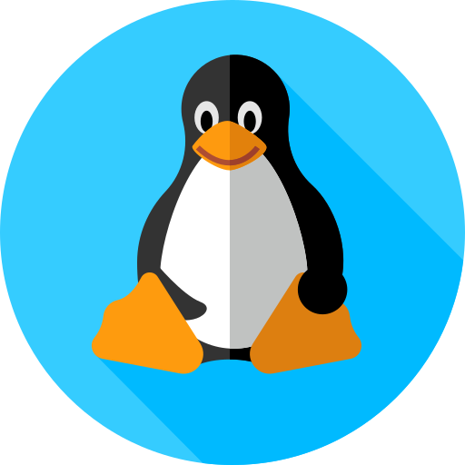

[]

 
 

### Skills and Tools

[][html]
[][css]
[][javascript]

[html]: https://www.w3.org/html
[css]: https://www.w3.org/Style/CSS
[javascript]: https://devdocs.io/javascript

 
 

[][python]

[python]: https://www.python.org

 
 

[][numpy]

[numpy]: https://numpy.org/

 
 

[][sql]
[][sqlite]

[sql]: https://www.iso.org/standard/63555.html
[sqlite]: https://www.sqlite.org

 
 

[][mongodb]

[mongodb]: https://www.mongodb.com

 
 

[][git]
[][docker]

[git]: https://git-scm.com
[docker]: https://docker.com

 
 

[][linux]
[][cmd]

[linux]: https://www.linuxfoundation.org
[cmd]: https://github.com/SirKarib/LinuxAliases

 
 

### Codewars

[][codewars]

[codewars]: https://www.codewars.com/users/SirKarib
